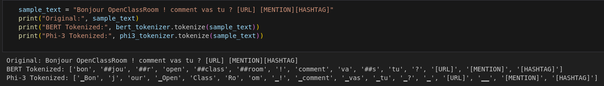
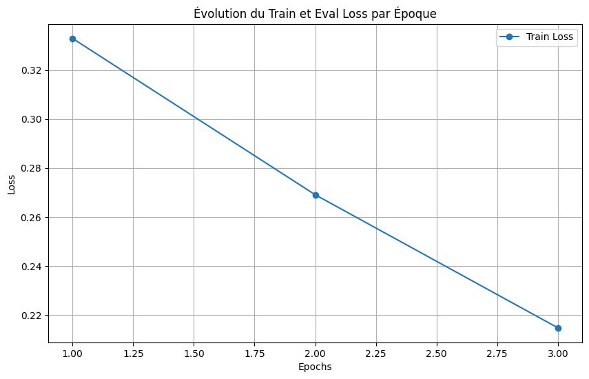
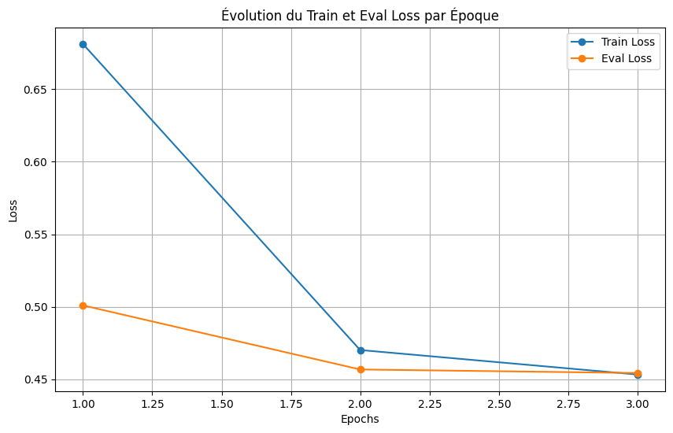
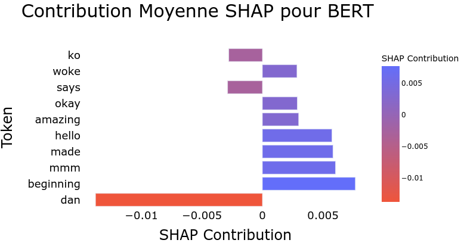
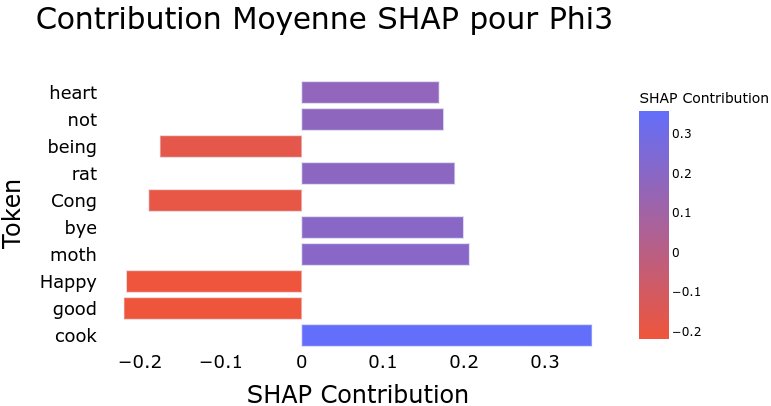
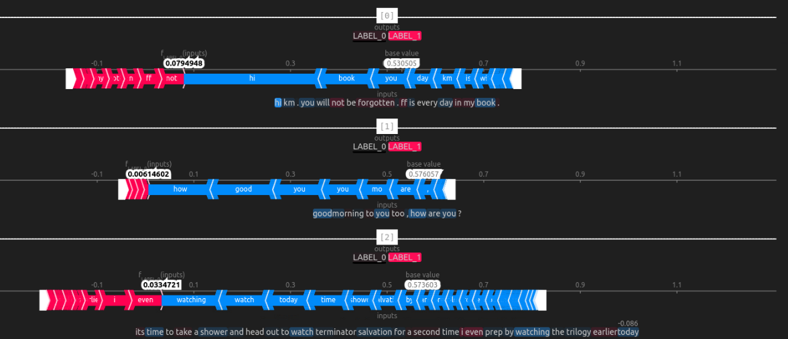
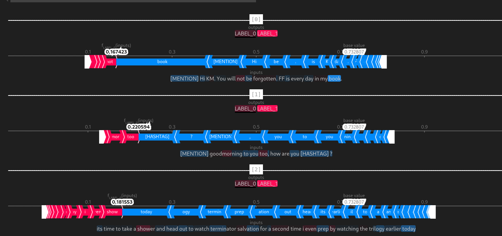

# Automatic Tweet Classification with a Causal Language Model (CLM)

## Table of Contents

- [Introduction](#introduction)
- [Evaluation Metrics and Results](#evaluation-metrics-and-results)
- [Conclusion](#conclusion)
- [Environment Setup](#environment-setup)

## Introduction

This project explores the use of a causal language model (CLM), **Phi-3**, for the automatic classification of tweets into positive and negative sentiments. We originally chose this model because of its advantages in terms of text generation and resource optimization. However, after running the experiments and analyzing the results, we observed some inherent limitations of CLMs for classification tasks, which we will detail later in this paper.

This README aims to provide a comprehensive and detailed guide for researchers and developers who wish to replicate this experiment or use a similar CLM model like Phi-3 for text classification tasks.

## Background on CLM Models

This project explores the use of a Causal Language Model (CLM), **Phi-3**, for the automatic classification of tweets into positive and negative sentiments. **Causal Language Models (CLMs)** are primarily used for text generation tasks. However, these models can be adapted for classification tasks with appropriate training techniques. The **Phi-3** model is an example of a CLM optimized to operate in low-memory environments.

One key feature of Phi-3 is that its **Phi-3-mini** variant, with 3.8 billion parameters, has been specifically optimized to run natively on devices like the **iPhone 14**, which is equipped with the **A16 Bionic chip**. In this environment, Phi-3-mini can achieve an inference speed of up to **12 tokens per second** with 4-bit quantization, making it suitable for real-time applications without relying on cloud-based resources.

We compare its performance with a more common model, **BERT**, to understand the trade-offs between resource optimization and result accuracy.

### Why Use a CLM for Classification?

The choice of using a CLM for classification was motivated by several potential advantages, such as:
1. **Modularity**: CLMs can be adjusted to capture sequential information in textual data.
2. **Ability to learn from large datasets**: With the right adjustments, a model like Phi-3 can efficiently process large volumes of text.
3. **Resource optimization**: Techniques like **LoRA** and **quantization** allow CLMs to be trained in resource-limited environments, making them accessible to a broader audience.

## Dataset and Preprocessing

The dataset contains **1.4 million tweets** in English, collected via the Twitter API. These tweets are highly diverse and cover a wide range of subjects, tones, and opinions, making it a complex classification challenge.

### Data Preprocessing

Preprocessing was crucial to ensure that only relevant elements were used by the model. The main steps included:
- **Tokenization**: Each model used its specific tokenizer. BERT uses a subword-based approach, while Phi-3, being a unidirectional model, uses more sequential tokenization.
- **Replacing URLs, mentions, and hashtags**: These elements were replaced with specific tokens ([URL], [MENTION], [HASHTAG]) to preserve minimal context while eliminating distractions.  
  
- **Normalization and cleaning**: Text was converted to lowercase, and special characters such as excessive punctuation or emojis were removed.

We deliberately chose not to include **lemmatization** to preserve contextual nuances in the words, an important aspect of sentiment analysis where morphological variations can affect the overall meaning.

### Dataset Split

- **80% of the data** was used for training.
- **20% of the data** was reserved for testing to ensure the model is evaluated on unseen data.

## Models and Techniques Used

### BERT (Baseline Model)
**BERT-base** was chosen as the baseline model for this project. This model, pre-trained on large amounts of text, captures complex contextual relationships due to its bidirectional architecture.

#### Training
- **Precision of weights**: Mixed-precision (16-bit).
- **Number of epochs**: 3 epochs.
- **VRAM used**: 6 GB.

BERT served as the benchmark for measuring Phi-3's performance, providing a solid baseline with robust performance metrics.

### Phi-3 with LoRA and 4-bit Quantization

Phi-3 is a **CLM** model. Unlike BERT, which is bidirectional, **Phi-3 is unidirectional** and has been optimized for training on resource-limited machines using the following techniques:
- **LoRA (Low-Rank Adaptation)**: A fine-tuning technique that factorizes weight matrices into smaller, trainable submatrices, reducing the number of parameters to adjust.
- **4-bit Quantization (nf4)**: Compresses weights to 4-bit precision, coupled with double quantization to stabilize the model.
- **Gradient Accumulation**: Accumulates gradients over several mini-batches to simulate larger batch sizes without overloading memory.

#### Training
- **Precision of weights**: 4-bit.
- **Number of epochs**: 3 epochs.
- **VRAM used**: 64 GB (simulated via gradient accumulation).
- **Training time**: 5 days.

\[
\text{Total simulated VRAM} = 1.865 \, \text{Go} + (0.00472 \, \text{Go} \times 32) + \left( \frac{32 \times 150 \times 3072 \times 4}{10^9} \times 32 \right)
\]

The choice of Phi-3-mini was driven by the goal of creating a sentiment classification model capable of running efficiently on mobile devices like the iPhone 14. This focus on real-time, on-device processing prioritizes resource optimization over absolute accuracy.

## Evaluation Metrics and Results

The models were evaluated using standard metrics such as:
- **Accuracy**: The proportion of correctly classified tweets.
- **F1-Score**: A combined measure of precision and recall.
- **Confusion Matrix**: To evaluate false positives and false negatives.

| Model   | Accuracy  | F1-Score | Training Time | VRAM Used |
|---------|-----------|----------|---------------|-----------|
| BERT    | 89%       | 0.86     | 15 hours      | 6 GB      |
| Phi-3   | 78.72%    | 0.7871   | 5 days        | 42 GB     |

While Phi-3 uses memory reduction techniques, it lags in accuracy compared to BERT, mainly due to its limited number of trainable parameters (0.25% vs. 100% for BERT).

### Training Curve Analysis (BERT vs. Phi-3)

The training and evaluation loss curves for BERT and Phi-3 reveal significant differences in the behavior of the two models during training.

#### Bert

#### Phi3


#### BERT Training Curve
The BERT training curve shows a **rapid and continuous reduction in loss** from the first epoch. This indicates BERT’s ability to converge quickly, reaching a relatively low loss in just three epochs. The evaluation loss closely follows the training loss, suggesting that the model is not overfitting and generalizes well to unseen data.

This efficiency is attributed to BERT’s capacity to train **100% of its parameters**. The model adjusts all its layers and fully exploits its bidirectional architecture, leading to quick performance improvements.

#### Phi-3 Training Curve
In contrast, Phi-3's curve shows a **more gradual reduction in loss**, with much slower convergence compared to BERT. Even after three epochs, the curve suggests that the model could still improve with additional epochs, but the rate of convergence indicates that it would eventually plateau with minimal further improvements.

This slowness is directly tied to the limitations of the applied techniques:
- **LoRA** restricts the number of trainable parameters (only 0.25%), limiting the model’s ability to efficiently adapt to the data.
- **4-bit quantization** further limits the precision of weight adjustments, leading to less accurate parameter updates.

Thus, **Phi-3** demonstrates that it can converge, but at a much slower rate, and it is likely that even with additional epochs, it would not match BERT's performance. The optimization for memory resources comes at the expense of training speed and final performance.

## SHAP Analysis (Feature Importance)

### Global Importance

The global analysis of tokens reveals a divergence in how BERT and Phi-3 interpret tweets:
- **BERT** captures more common tokens in everyday language, such as "okay", "hello", and "amazing", which strongly influence sentiment predictions.  
  
- **Phi-3** focuses more on specific words like "not", "good", or "heart", favoring a more linear analysis of the sentence structure.  
  

### Local Importance

The local visualizations reveal subtle differences in how each model processes individual tweets:
- **BERT** effectively captures negations and the overall context, assigning high importance to words like "not" in negative classifications.  
  
- **Phi-3**, while effective, tends to analyze tokens sequentially without integrating as much global context.  
  

## Theoretical Limitations

This project has led to a better understanding of the limitations of CLMs for tasks other than text generation. Although **Phi-3** performs well for generation tasks, its unidirectional architecture has proven its limitations in classification, particularly in terms of capturing the global context of sentences. This point came up during experimentation, and highlighted the importance of choosing models adapted to specific tasks.

### Alternative CLM Models

In addition to Phi-3, several other Causal Language Models could be used for similar tasks with the same trade-offs between performance and resource optimization:

1. **LLaMA 3**: A CLM developed by Meta, known for its efficiency in text generation tasks with a reduced memory footprint.
2. **Mixtral**: Another CLM designed for text generation tasks, which can be adapted for classification via fine-tuning.
3. **GPT-3.5/4**: OpenAI's GPT model, primarily used for text generation, can also be fine-tuned for classification tasks.
4. **Jurassic-2**: A model developed by AI21 Labs, offering extensive text generation capabilities with optimized infrastructure for inference.
5. **Mistral**: A more recent model, focused on text generation tasks, offering impressive performance in resource-limited environments.

These models share the same inherent limitations of the unidirectional CLM architecture, and while they can be adapted

 for classification, they may not be optimal for text comprehension tasks where global context is crucial.

### Alternative Models for Classification

For classification tasks, it may be more effective to use architectures specifically designed for text comprehension, such as:
- **Masked Language Modeling (MLM)**: Models like **BERT** and **RoBERTa** are better suited for classification tasks as they consider the bidirectional context of a sentence.
- **Permuted Language Modeling (PLM)**: Used by **XLNet**, this hybrid approach combines elements of generation and classification, offering a unique balance for certain tasks.
- **Text-to-Text Transfer Transformer (T5)**: This model converts every task into a text generation problem, making it highly flexible for a wide range of applications, including classification.

## Future Improvements

To further improve CLM model performance on classification tasks, several avenues can be explored:

1. **Use more powerful hardware**: Currently, Phi-3 training is limited by a single GPU with 6 GB of VRAM. Adding multiple GPUs or more powerful GPUs (such as an **RTX 4090** or a **Nvidia H100**) could significantly reduce training time while allowing for larger batch sizes.
2. **Reduce the level of quantization**: While 4-bit quantization reduces memory usage, it can lead to a loss in accuracy. Training with **8-bit** or full precision (**16-bit** or **32-bit**) would likely improve performance, though this would require more resources.
3. **Remove LoRA**: While LoRA enabled Phi-3 to adapt to resource-limited environments, full fine-tuning of the model would be preferable if sufficient resources are available. This would allow training of the entire model, increasing its capacity to fully adapt to the classification task.

## Conclusion

The results obtained with the **Phi-3** Causal Language Model (CLM) initially appeared promising, particularly regarding **resource optimization**. Phi-3, especially its **mini** version optimized for low-memory environments like mobile devices (iPhone 14), demonstrated acceptable performance in terms of **inference speed** and **model size reduction**, thanks to techniques like **4-bit quantization**. These advantages, particularly in deploying models on resource-constrained devices for real-time text processing, were appealing.

However, a **deeper analysis of the performance metrics** revealed inherent **limitations** of using CLMs for **classification tasks**, as opposed to their primary use case of text generation. Specifically, metrics such as **accuracy** and **F1-score** showed a **significant gap** compared to a **bidirectional model** like **BERT**, which is specifically designed to capture the global context of sentences.

The unidirectional architecture of CLMs, which processes text sequences in a single direction (left to right), directly affects the model’s ability to capture **complex contextual dependencies**, which are crucial for text classification tasks. In contrast, **BERT**, with its bidirectional processing, can analyze text in both directions, better understanding nuances and relationships between words in a sentence.

This **realization** emerged after multiple iterations of training and evaluation. The **performance metrics** revealed that, while Phi-3 is capable of converging, its ability to reach performance levels comparable to bidirectional models remains limited. The **slow convergence** and inability to fully capture **global context** confirmed that, while CLMs are effective for text generation, they are **less suited** for classification tasks that require comprehensive contextual understanding.

Ultimately, this project highlighted the **strengths and weaknesses** of using CLMs like Phi-3 in tasks that diverge from their primary function. While Phi-3 is optimized for environments with limited resources, achieving high performance in text classification, where deep contextual understanding is crucial, requires models like **BERT** or other bidirectional architectures. This experience has shown that **bidirectional** or **permuted** models (such as BERT or XLNet) are better suited for classification tasks where **accuracy and contextual analysis** are essential.

In the future, it would be interesting to explore how CLMs could be **improved** or **hybridized** with other architectures to achieve more competitive results in classification tasks. However, for applications requiring high classification accuracy today, using **models specifically designed for this task** remains the most appropriate choice.

## Environment Setup

To configure and use your notebook for tweet classification, follow these steps:

### Installation Steps

1. **Clone the repository:**
   ```bash
   git clone git@github.com:S8N02000/tweet-sentiment-classification-clm-phi3.git
   cd tweet-sentiment-classification-clm-phi3
   ```

2. **Download the Sentiment140 dataset:**
   Download the zip file from the following link, place it in the `./data/RAW` folder, unzip it, and delete the zip file. This file is from [Kaggle](https://www.kaggle.com/datasets/kazanova/sentiment140).

   ```bash
   wget https://s3-eu-west-1.amazonaws.com/static.oc-static.com/prod/courses/files/AI+Engineer/Project+7%C2%A0-+D%C3%A9tectez+les+Bad+Buzz+gr%C3%A2ce+au+Deep+Learning/sentiment140.zip -P ./data/RAW
   unzip ./data/RAW/sentiment140.zip -d ./data/RAW
   rm ./data/RAW/sentiment140.zip
   ```

3. **Download the FastText language detection model:**
   Download the `lid.176.bin` file and place it in the root of the project.
   ```bash
   wget https://dl.fbaipublicfiles.com/fasttext/supervised-models/lid.176.bin -P ./
   ```

4. **Install dependencies:**
   Ensure Python is installed. You can then install all the required dependencies using the `requirements.txt` file:
   ```bash
   pip install -r requirements.txt
   ```

### `requirements.txt` File Content:

```txt
# Machine Learning & Transformers
torch==2.4.1
transformers==4.45.1
tokenizers==0.20.0
datasets==3.0.1
peft==0.13.0
accelerate==0.34.2
fasttext==0.9.3

# Optimization and Acceleration
flash-attention==1.0.0
BitsAndBytesConfig==0.0.4

# Text Analysis, NLP & Visualization
shap==0.46.0
wordcloud==1.9.3
seaborn==0.13.2
matplotlib==3.9.2
pandas==2.2.3
scikit-learn==1.5.2
numpy==2.0.2

# General utilities
tqdm==4.66.5

# Huggingface and related tools
huggingface-hub==0.25.1

# Plotly for advanced graphing
plotly==5.24.1

# Logging and monitoring
tensorboard==2.18.0
tensorboardX==2.6.2.2
```

### Unix Commands

For Unix systems (Linux or macOS), here is a summary of the commands to set up the environment:

```bash
# 1. Clone the repository
git clone git@github.com:S8N02000/tweet-sentiment-classification-clm-phi3.git
cd tweet-sentiment-classification-clm-phi3

# 2. Download and unzip the Sentiment140 dataset, then remove the zip file
mkdir -p ./data/RAW
wget https://s3-eu-west-1.amazonaws.com/static.oc-static.com/prod/courses/files/AI+Engineer/Project+7%C2%A0-+D%C3%A9tectez+les+Bad+Buzz+gr%C3%A2ce+au+Deep+Learning/sentiment140.zip -P ./data/RAW
unzip ./data/RAW/sentiment140.zip -d ./data/RAW
rm ./data/RAW/sentiment140.zip

# 3. Download the FastText language detection model
wget https://dl.fbaipublicfiles.com/fasttext/supervised-models/lid.176.bin -P ./

# 4. Install dependencies
pip install -r requirements.txt
```

This section will allow users to quickly set up the necessary environment to run the notebook and successfully complete the tweet classification project.